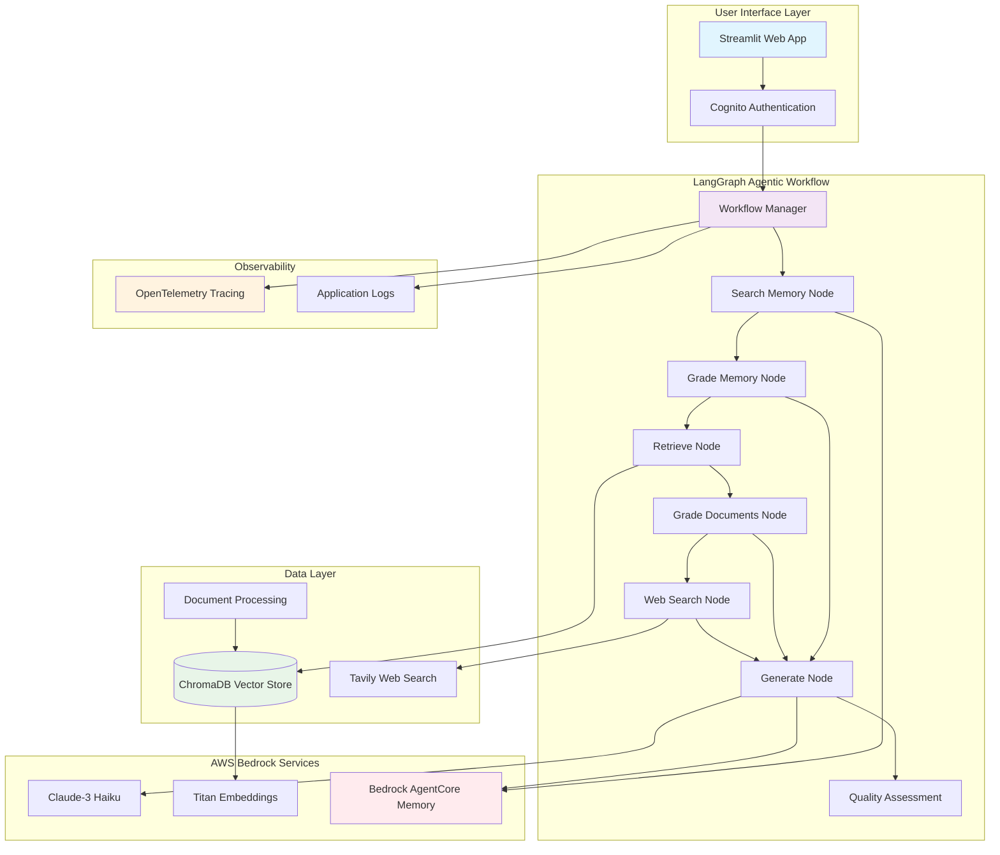

# Langgraph_rag_chatbot_with_advance_memory

# LangGraph RAG - Agentic AI Chatbot with Memory & Observability

An enterprise-grade Retrieval-Augmented Generation (RAG) chatbot system built with LangGraph, AWS Bedrock AgentCore, and Streamlit. This system provides intelligent document processing, persistent conversational memory, adaptive query routing, and comprehensive observability for production deployments.

## 🏗️ Architecture Overview



## 🚀 Key Features

### 🤖 LangGraph Agentic Workflow
- **State-Based Processing**: Uses TypedDict for structured state management
- **Memory-First Routing**: Prioritizes conversation history for contextual responses
- **Conditional Decision Making**: Dynamic routing between memory, vector store, and web search
- **Multi-Stage Validation**: Document relevance, hallucination, and answer quality checks
- **Adaptive Fallback**: Automatic web search when local knowledge is insufficient
- **Graph Compilation**: Optimized workflow execution with cycle detection

### 🔍 Intelligent Query Processing
- **Memory-Aware Routing**: Checks conversation history before document retrieval
- **Document Grading**: Relevance assessment before answer generation
- **Hallucination Detection**: Ensures answers are grounded in retrieved documents
- **Answer Quality Assessment**: Validates if generated answers address the question
- **Iterative Refinement**: Re-generates answers if quality checks fail
- **Context Fusion**: Combines memory, documents, and web search intelligently

### 📄 Document Processing & Retrieval
- **Multi-Format Support**: PDF, DOCX, and TXT file processing
- **Web Content Ingestion**: Automatic processing of web URLs
- **Vector Store**: ChromaDB with Titan embeddings for semantic search
- **Text Chunking**: 512-character chunks with no overlap for optimal retrieval
- **Retrieval Configuration**: Top-2 document retrieval for focused context

### 🧠 Persistent Conversational Memory
- **AWS Bedrock AgentCore**: Enterprise-grade memory management
- **Cross-Session Continuity**: Conversations persist across user sessions
- **User-Specific Memory**: Individual conversation histories with privacy isolation
- **Contextual Follow-ups**: References previous interactions naturally
- **Memory Grading**: Evaluates relevance of conversation history to current queries

### 🌐 Hybrid Information Sources
- **Conversation Memory**: Persistent chat history with semantic search
- **Local Knowledge Base**: Vector database with uploaded documents
- **Real-Time Web Search**: Tavily API integration for current information
- **Source Attribution**: Clear indication of information sources
- **Context Fusion**: Combines memory, documents, and web search seamlessly

### 📊 Production-Ready Observability
- **OpenTelemetry Integration**: Distributed tracing across all components
- **Session Context Tracking**: User and session-specific telemetry
- **Performance Monitoring**: Response times, memory usage, and error rates
- **Structured Logging**: Comprehensive debugging and audit trails
- **Health Checks**: System component status monitoring

### 🔐 Enterprise Security
- **AWS Cognito Authentication**: User management with MFA support
- **IAM Policy Integration**: Fine-grained access control
- **Session Management**: Secure user sessions with JWT tokens
- **Data Isolation**: User-specific memory and conversation privacy

## 📋 Dependencies

### Core Framework
```
langgraph>=0.0.40
langchain>=0.1.0
langchain-aws>=0.1.0
langchain-community>=0.0.20
streamlit>=1.28.0
```

### AWS Integration & Memory
```
boto3>=1.34.0
botocore>=1.34.0
bedrock-agentcore>=1.0.0
```

### Vector Store & Embeddings
```
chromadb>=0.4.0
tiktoken>=0.5.0
```

### Document Processing
```
PyPDF2>=3.0.0
python-docx>=0.8.11
```

### Web Search & APIs
```
tavily-python>=0.3.0
```

### Observability & Monitoring
```
opentelemetry-api>=1.20.0
opentelemetry-sdk>=1.20.0
opentelemetry-instrumentation>=0.41b0
```

### Utilities
```
python-dotenv>=1.0.0
typing-extensions>=4.5.0
```

## 🔧 Installation

### 1. Clone Repository
```bash
git clone <repository-url>
cd langgraph_rag
```

### 2. Create Virtual Environment
```bash
python -m venv venv
source venv/bin/activate  # On Windows: venv\Scripts\activate
```

### 3. Install Dependencies
```bash
pip install langgraph langchain langchain-aws langchain-community streamlit
pip install boto3 bedrock-agentcore chromadb tiktoken PyPDF2 python-docx tavily-python
pip install opentelemetry-api opentelemetry-sdk opentelemetry-instrumentation
pip install python-dotenv typing-extensions
```

### 4. Environment Setup
Create a `.env` file:
```env
AWS_ACCESS_KEY_ID=your_aws_access_key
AWS_SECRET_ACCESS_KEY=your_aws_secret_key
AWS_REGION=us-east-1
TAVILY_API_KEY=your_tavily_api_key
```

### 5. AWS Configuration
Create `config/aws_config.json`:
```json
{
    "aws_access_key_id": "your_aws_access_key",
    "aws_secret_access_key": "your_aws_secret_key",
    "region_name": "us-east-1",
    "cognito": {
        "user_pool_id": "your_user_pool_id",
        "client_id": "your_client_id"
    }
}
```

### 6. AWS Bedrock Setup
Ensure you have access to:
- `anthropic.claude-3-haiku-20240307-v1:0`
- `amazon.titan-embed-text-v1`
- Bedrock AgentCore Memory service

## 🚀 Usage

### 1. Run Streamlit Interface
```bash
streamlit run chatbot_ui.py
```
Web interface available at `http://localhost:8501`

### 2. Run Command Line Interface
```bash
python main.py
```

### 3. Run Complete Workflow
```bash
python main_file.py
```

## 🏗️ Project Structure

```
rag_chatbot_with_advance_memory/
├── chatbot_ui.py         # Streamlit web interface with authentication
├── main.py              # Main application entry point
├── config.py            # AWS Bedrock configuration
├── agents.py            # LangGraph agent definitions
├── workflow.py          # LangGraph workflow manager with memory
├── document_handler.py  # File processing utilities
├── document_processor.py # Document loading and vectorstore
├── web_search.py        # Tavily search integration
├── handlers/
│   └── auth_handler.py  # AWS Cognito authentication
├── components/
│   └── login_page.py    # Streamlit login interface
├── utils/
│   └── telemetry.py     # OpenTelemetry context management
├── config/
│   └── aws_config.json  # AWS service configuration
├── static/
│   └── style.css        # UI styling
├── chroma_db/           # Vector database storage
└── README.md           # This documentation
```

## 🔄 LangGraph Workflow

### State Definition
```python
class GraphState(TypedDict):
    question: str
    generation: str
    web_search: str
    documents: List[str]
```

### Workflow Nodes
1. **Search Memory**: Queries conversation history from AgentCore
2. **Grade Memory**: Evaluates relevance of retrieved memory
3. **Retrieve**: Fetches relevant documents from vectorstore
4. **Grade Documents**: Assesses document relevance
5. **Web Search**: Performs web search when needed
6. **Generate**: Creates answer with memory context
7. **Quality Gates**: Validates answer quality and groundedness

### Decision Points
- **Entry Point**: Always starts with memory search
- **Memory Assessment**: generate vs retrieve (if memory sufficient)
- **Document Assessment**: generate vs websearch
- **Quality Check**: useful vs not_useful vs not_supported

## 🛠️ Components

### Memory Search Node
Queries conversation history for context:
- **AgentCore Integration**: Retrieves relevant past conversations
- **Session Filtering**: User and session-specific memory access
- **Semantic Search**: Finds contextually relevant conversation history
- **Error Handling**: Graceful fallback when memory unavailable

### Memory Grader
Evaluates conversation history relevance:
- **Input**: Question + Retrieved memory context
- **Output**: 'yes' or 'no' relevance score

### Retrieval Grader
Assesses document relevance with binary scoring:
- **Input**: Question + Retrieved document
- **Output**: 'yes' or 'no' relevance score

### Hallucination Grader
Validates answer groundedness:
- **Input**: Generated answer + Source documents
- **Output**: 'yes' or 'no' grounding score

### Answer Grader
Evaluates answer usefulness:
- **Input**: Generated answer + Original question
- **Output**: 'yes' or 'no' usefulness score

## 📊 Performance Features

- **Memory-First Architecture**: Prioritizes conversation context for faster responses
- **Efficient Chunking**: 512-character chunks for optimal context
- **Focused Retrieval**: Top-5 documents to minimize noise
- **State Management**: Structured data flow through workflow
- **Error Handling**: Comprehensive exception management with graceful degradation
- **Distributed Tracing**: OpenTelemetry spans for performance monitoring
- **Session Caching**: User-specific context caching for improved performance

## 🔒 Security & Best Practices

- **AWS Cognito Authentication**: Secure user management with MFA support
- **IAM Policy Enforcement**: Fine-grained access control for AWS services
- **Environment Variables**: Secure API key management
- **User Data Isolation**: Separate memory contexts per user
- **Session Security**: JWT token-based authentication
- **Input Validation**: Sanitized user inputs
- **Audit Trails**: Comprehensive logging for compliance
- **Resource Management**: Efficient memory and compute usage

## 🤝 Contributing

1. Fork the repository
2. Create feature branch (`git checkout -b feature/amazing-feature`)
3. Commit changes (`git commit -m 'Add amazing feature'`)
4. Push to branch (`git push origin feature/amazing-feature`)
5. Open Pull Request

## 📄 License

This project is licensed under the MIT License - see the LICENSE file for details.

## 🔧 Configuration

### Memory Configuration
- **Event Expiry**: 7 days default retention
- **Session Management**: User-specific actor and session IDs
- **Memory Strategies**: Configurable retention policies
- **Error Handling**: Graceful degradation when memory unavailable

### Observability Configuration
- **Tracing**: OpenTelemetry spans for all operations
- **Metrics**: Custom metrics for performance monitoring
- **Logging**: Structured logs with session context
- **Health Checks**: System component status monitoring

## 🆘 Support

For issues and questions:
1. Check existing GitHub issues
2. Create new issue with detailed description
3. Include error logs and system information
4. Provide steps to reproduce the problem
5. Include session/trace IDs for observability issues

---

**Built with ❤️ using LangGraph, AWS Bedrock AgentCore, and LangChain**
